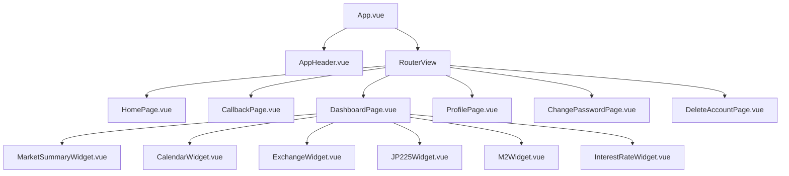

# コンポーネント設計

## 概要

本ドキュメントは、フロントエンドのコンポーネント構成と各コンポーネントの責務を定義する。

---

## コンポーネントツリー



---

## レイアウト

### App.vue

ルートコンポーネント。`AppHeader` と `RouterView` を配置する。

- 状態: なし
- ロジック: なし

### AppHeader.vue

グローバルヘッダー。全ページ共通で表示される。

| 要素 | 条件 | 動作 |
|------|------|------|
| ロゴ（Finance Dashboard） | 常時 | `/` へ遷移 |
| ダッシュボードリンク | 認証済み | `/dashboard` へ遷移 |
| ユーザーメール表示 | 認証済み | `/profile` へ遷移 |
| ログアウトボタン | 認証済み | ログアウト処理 |
| ログインボタン | 未認証 | ログイン処理 |

- 依存: `useAuth()`, `useRouter()`, PrimeVue Menubar

---

## ページコンポーネント

### HomePage.vue

未認証ユーザー向けのランディングページ。

- 認証済みの場合、ルーターガードにより `/dashboard` へリダイレクトされる
- 未認証の場合、ヒーローセクションとログインボタンを表示する
- 依存: `useAuth()`

### CallbackPage.vue

OAuth コールバック処理ページ。

- URL パラメータから `code` を取得し、PKCE フローでトークンを交換する
- 成功時: `/dashboard` へリダイレクト
- 失敗時: エラーメッセージを表示
- 依存: `exchangeCodeForTokens()`, `useRouter()`

### DashboardPage.vue

メインダッシュボード。ウィジェットの表示・レイアウトを管理する。

#### ウィジェット管理

```typescript
interface ChartEntry {
  id: string          // 一意の識別子
  label: string       // UI 表示名
  component: Component // Vue コンポーネント参照（shallowRef）
  visible: boolean    // 表示/非表示状態
}
```

- `availableCharts`: 全ウィジェットの定義配列
- `visibleCharts`: `visible === true` のウィジェットのみを返す computed

#### レイアウト制御

- CSS Grid によるグリッドレイアウト
- 列数: 1 / 2 / 3 列を Select で切り替え可能（デフォルト: 2）
- モバイル: メディアクエリで自動的に 1 列に切り替え

#### ウィジェット追加手順

1. `components/widgets/` に新しいウィジェットコンポーネントを作成
2. `DashboardPage.vue` の `availableCharts` に `ChartEntry` を追加

### ProfilePage.vue

ユーザープロフィール表示ページ。

- マウント時に `getMe()` API を呼び出し、ユーザー情報を取得する
- 表示項目: ユーザー名、メールアドレス（認証済みマーク付き）、登録日
- ナビゲーション: パスワード変更、アカウント削除への導線
- 依存: `getMe()` API, `useRouter()`

### ChangePasswordPage.vue

パスワード変更ページ。

- Cognito SDK (`ChangePasswordCommand`) を Access トークンで直接呼び出す
- バックエンド API は経由しない
- DEV モードではモック成功を返す
- 依存: `getAccessToken()`, Cognito SDK

### DeleteAccountPage.vue

アカウント削除ページ。

- パスワード入力 → 確認ダイアログ → バックエンド API 呼び出しの 2 段階確認
- 成功時: ログアウト → `/` へリダイレクト
- 依存: `deleteMe()` API, `useAuth()`, `useRouter()`

---

## ウィジェットコンポーネント

すべて `components/widgets/` に配置する。各ウィジェットは独立しており、props / emits を持たない自己完結型コンポーネントである。

### 一覧

| コンポーネント | データソース | 描画方式 | 対応 US |
|--------------|------------|---------|---------|
| MarketSummaryWidget | TradingView | 外部スクリプト埋め込み | US-4.1 |
| CalendarWidget | TradingView | 外部スクリプト埋め込み | US-4.2 |
| ExchangeWidget | TradingView | tv.js チャートウィジェット | US-4.3 |
| JP225Widget | TradingView | tv.js チャートウィジェット | US-4.4 |
| M2Widget | TradingEconomics | iframe 埋め込み | US-5.1 |
| InterestRateWidget | API (メイン API) | Lightweight Charts | US-6.1 |

### MarketSummaryWidget.vue

マーケット概況。TradingView の `embed-widget-market-quotes.js` を埋め込む。

- 表示シンボル: 主要株式指数（6）、先物（5）、FX（7）
- テーマ: ライト、日本語ロケール
- サイズ: 幅 100%、高さ 600px

### CalendarWidget.vue

経済カレンダー。TradingView の `embed-widget-events.js` を埋め込む。

- 主要通貨の経済イベントを表示
- テーマ: ライト、日本語ロケール
- サイズ: 幅 100%、高さ 600px

### ExchangeWidget.vue

FX チャート。TradingView の `tv.js` を使用したインタラクティブチャート。

- 通貨ペア選択: USD/JPY, EUR/JPY, EUR/USD, GBP/JPY, GBP/USD, AUD/JPY, AUD/USD, Dollar Index
- テクニカル指標切り替え: 一目均衡表 / BB+SMA
- マウスドラッグによるリサイズ（300px〜1200px）

### JP225Widget.vue

日経225チャート。ExchangeWidget と同様の構成だがシンボル固定（`OANDA:JP225USD`）。

- テクニカル指標切り替え: 一目均衡表 / BB+SMA
- マウスドラッグによるリサイズ（300px〜1200px）

### M2Widget.vue

日本のマネーサプライ M2。TradingEconomics の iframe を埋め込む。

- 日付範囲選択: 開始日・終了日を PrimeVue DatePicker で指定
- デフォルト範囲: 10年前〜今日
- iframe URL は日付範囲から computed で動的生成

### InterestRateWidget.vue

政策金利・長期金利チャート。API からデータを取得し、Lightweight Charts で描画する。

- 2 系列の折れ線チャート:
  - Federal Funds Target Rate (Upper) — 青
  - DGS10 (10-Year Treasury Yield) — オレンジ
- リフレッシュボタンでデータ再取得
- ローディング表示・エラーハンドリング
- ウィンドウリサイズ対応
- 依存: `getInterestRate()` API, Lightweight Charts

---

## 依存関係マトリクス

| コンポーネント | useAuth | useRouter | API 呼び出し | 外部ライブラリ |
|--------------|---------|-----------|-------------|--------------|
| AppHeader | ○ | ○ | - | PrimeVue |
| HomePage | ○ | - | - | PrimeVue |
| CallbackPage | ○ (exchange) | ○ | - | PrimeVue |
| DashboardPage | - | - | - | PrimeVue |
| ProfilePage | - | ○ | getMe | PrimeVue |
| ChangePasswordPage | ○ (token) | ○ | - | Cognito SDK, PrimeVue |
| DeleteAccountPage | ○ | ○ | deleteMe | PrimeVue |
| MarketSummaryWidget | - | - | - | TradingView |
| CalendarWidget | - | - | - | TradingView |
| ExchangeWidget | - | - | - | TradingView, PrimeVue |
| JP225Widget | - | - | - | TradingView, PrimeVue |
| M2Widget | - | - | - | PrimeVue |
| InterestRateWidget | - | - | getInterestRate | Lightweight Charts, PrimeVue |
