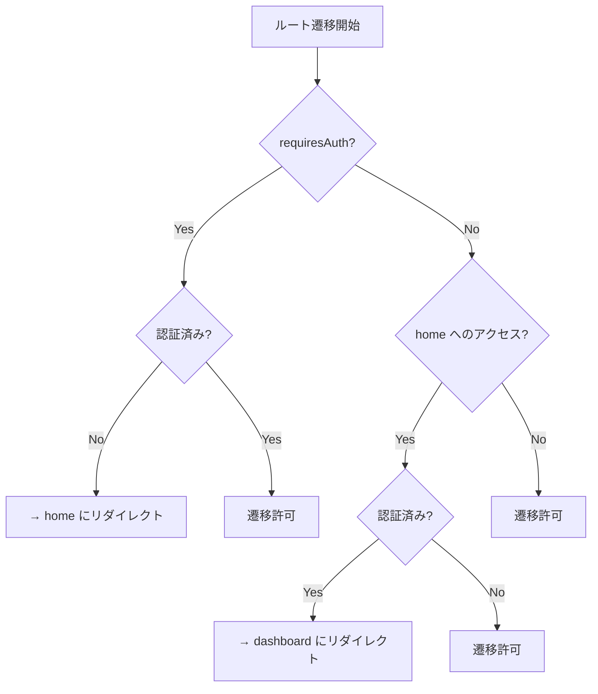
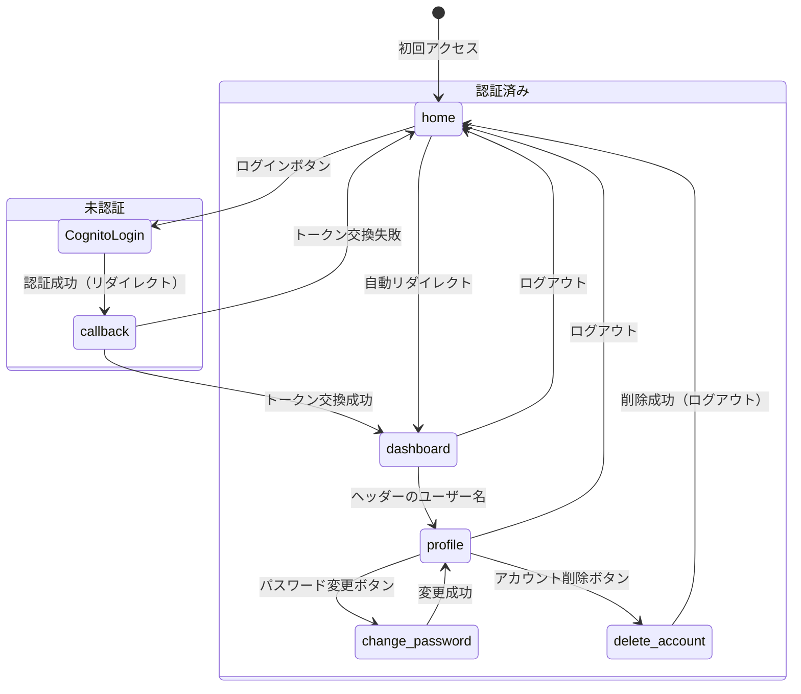

# ルーティング設計

## 概要

本ドキュメントは、フロントエンドのルーティング構成と遷移ルールを定義する。

---

## ルート一覧

| パス | 名前 | コンポーネント | 認証要 | 読み込み | 対応 US |
|------|------|--------------|--------|---------|---------|
| `/` | home | HomePage | ✗ | 即時 | - |
| `/callback` | callback | CallbackPage | ✗ | 即時 | US-1.1 |
| `/dashboard` | dashboard | DashboardPage | ✓ | 即時 | US-3.1, 3.2, 4.x, 5.1, 6.1 |
| `/custom-chart` | custom-chart | CustomChartPage | ✓ | 即時 | - |
| `/profile` | profile | ProfilePage | ✓ | 遅延 | US-2.1 |
| `/change-password` | change-password | ChangePasswordPage | ✓ | 遅延 | US-1.3 |
| `/delete-account` | delete-account | DeleteAccountPage | ✓ | 遅延 | US-2.2 |

- **即時**: `import` で直接読み込み（初回表示に必要なため）
- **遅延**: `() => import(...)` による遅延読み込み（コード分割）

---

## ナビゲーションガード

`router.beforeEach` で以下のルールを適用する。

| 条件 | 動作 |
|------|------|
| `meta.requiresAuth` が `true` かつ未認証 | `home` へリダイレクト |
| `home` にアクセスかつ認証済み | `dashboard` へリダイレクト |
| 上記以外 | そのまま遷移 |

---

## 画面遷移図

---

## 認証フロー詳細

### ログイン → ダッシュボード

1. ユーザーが `/` にアクセス → `HomePage` 表示
2. ログインボタン押下 → Cognito Managed Login にリダイレクト
3. Cognito で認証成功 → `/callback?code=xxx` にリダイレクト
4. `CallbackPage` で authorization code をトークンに交換
5. 成功 → `/dashboard` に `router.replace` で遷移
6. 失敗 → エラーメッセージ表示

### 認証済みユーザーの `/` アクセス

- `beforeEach` ガードにより `/dashboard` に自動リダイレクト
- `HomePage` は表示されない

### 未認証ユーザーの保護ページアクセス

- `beforeEach` ガードにより `/` にリダイレクト
- 例: `/dashboard`, `/profile` 等に直接アクセスした場合

### ログアウト

1. ヘッダーのログアウトボタン押下
2. sessionStorage からトークン削除
3. Cognito の `/logout` エンドポイントにリダイレクト
4. Cognito から `/` にリダイレクト

---

## 拡張ガイドライン

### 新しいページの追加

1. `src/pages/` にページコンポーネントを作成
2. `router/index.ts` の `routes` 配列にルート定義を追加
3. 認証が必要な場合は `meta: { requiresAuth: true }` を設定
4. 利用頻度が低いページは遅延読み込みにする
5. 必要に応じて `AppHeader` にナビゲーションリンクを追加
